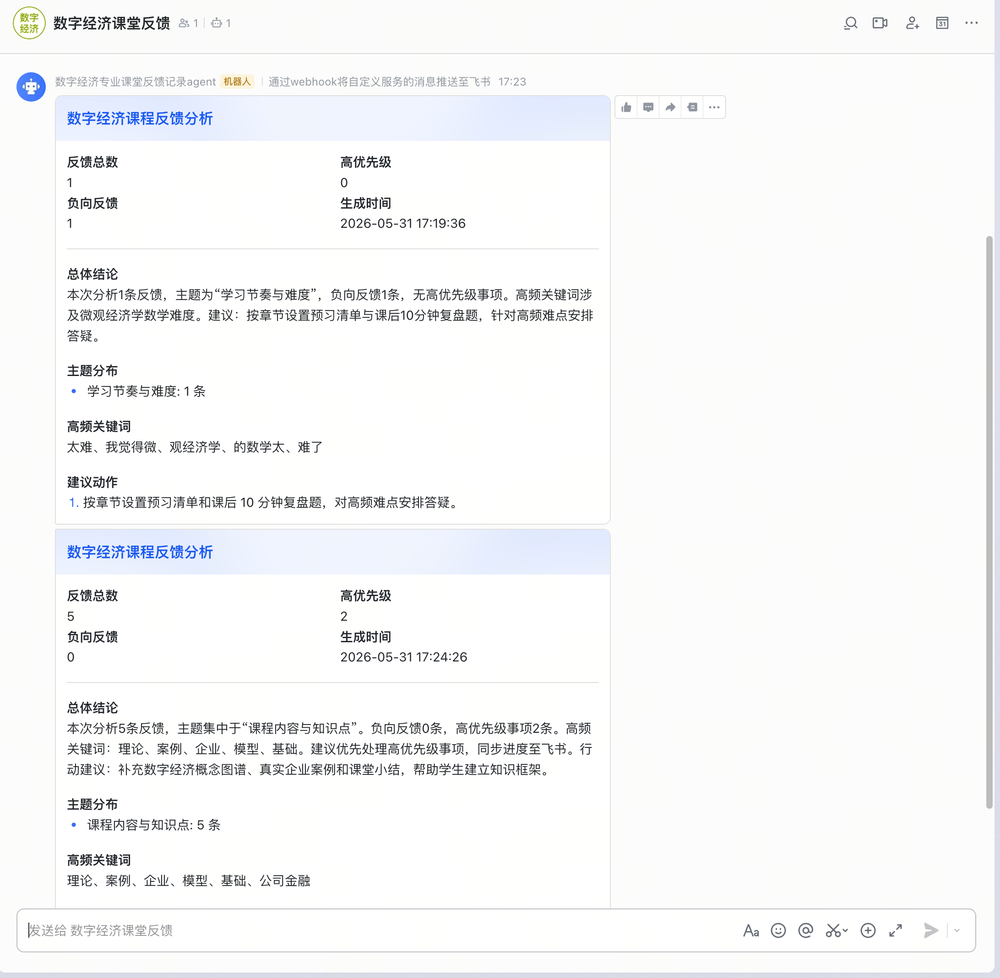
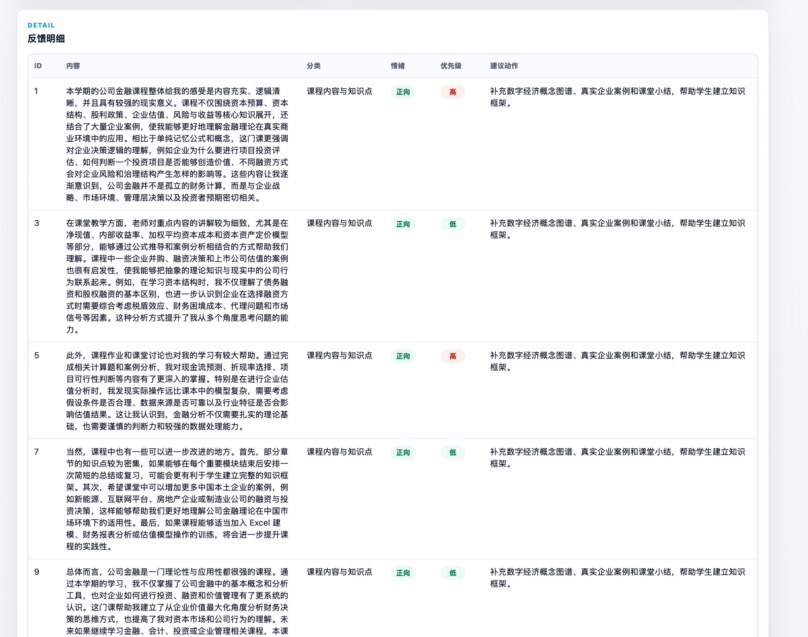
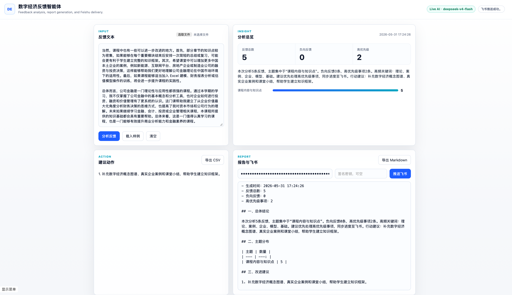

# 数字经济课程反馈分析与飞书通知智能体

面向数字经济课程教学与班级协同的 AI 智能体应用。系统读取学生反馈文本或 CSV 表格，自动完成主题分类、情绪判断、优先级标记、行动建议、Markdown 报告导出，并可通过飞书机器人推送分析摘要。项目支持本机运行、局域网跨设备访问、Docker 部署和云平台部署。

## 选题定位

| 模块 | 说明 |
| --- | --- |
| 服务对象 | 数字经济专业学生、任课教师、助教、学习委员 |
| 具体问题 | 课程反馈分散在聊天、表格和口头沟通中，人工汇总慢，难以及时识别高优先级问题 |
| 输入内容 | 多行反馈文本、CSV 文件、手动粘贴内容 |
| 输出结果 | 分类明细表、总体摘要、改进建议、Markdown 报告、飞书机器人卡片 |
| 处理步骤 | 读取数据 -> 清洗空白项 -> 分类 -> 情绪和优先级判断 -> 关键词提取 -> 生成报告 -> 飞书推送 |
| 模型任务 | 理解反馈意图、归纳主题、生成总结和建议；配置 `OPENAI_API_KEY` 后可接入真实 AI 润色摘要 |
| 工具任务 | Python CLI、Web UI、CSV/JSON/Markdown 导出、飞书 Webhook 推送、单元测试、Docker/云部署 |
| 异常情况 | 空输入返回提示；缺少飞书 URL 不中断分析；AI 调用失败时回退到离线规则；无明确关键词时归入“其他” |

## 项目结构

```text
.
├── data/sample_feedback.csv      # 示例数据
├── docs/                         # 设计、部署、截图、工作流、展示、反思、测试报告
├── src/feedback_agent/           # 智能体核心代码
├── tests/                        # 单元测试
├── web/                          # Web 界面
├── Dockerfile
├── pyproject.toml
└── README.md
```

## 快速运行

本项目默认不需要安装第三方依赖。

```bash
cd digital-economy-feedback-agent
PYTHONPATH=src python3 -m feedback_agent analyze -i data/sample_feedback.csv -o outputs/report.md --json outputs/result.json
```

启动 Web 界面。默认监听 `0.0.0.0`，同一局域网的其他设备可以通过主机 IP 访问：

```bash
PYTHONPATH=src python3 -m feedback_agent serve --host 0.0.0.0 --port 8765
```

本机访问：

```text
http://127.0.0.1:8765
```

其他设备访问：

```text
http://<运行这台电脑的局域网IP>:8765
```

## 接入真实 AI

设置 `OPENAI_API_KEY` 后，系统会自动调用 OpenAI 兼容接口润色分析摘要；失败时自动回退到离线规则。

```bash
export OPENAI_BASE_URL="https://api.openai.com/v1"
export OPENAI_API_KEY="sk-..."
export OPENAI_MODEL="gpt-4.1-mini"
PYTHONPATH=src python3 -m feedback_agent serve
```

前端右上角会显示 `Live AI · <model>`。如果只想用离线规则：

```bash
export FEEDBACK_AGENT_USE_LLM=0
```

项目优先读取 shell / 系统环境变量；如果当前目录存在 `.env`，只会用它补充缺失的变量，不会覆盖你在 bashrc/zshrc 里已经 export 的值。完整跨设备、Docker 和云平台部署见 [docs/deployment.md](docs/deployment.md)。

## CLI 示例

生成示例数据：

```bash
PYTHONPATH=src python3 -m feedback_agent sample -o data/sample_feedback.csv
```

直接分析一段文本：

```bash
PYTHONPATH=src python3 -m feedback_agent quick $'Python 作业报错，希望补充模板。\n考试范围不清楚，复习压力大。'
```

## 飞书机器人配置

方式一：命令行环境变量。

```bash
export FEISHU_WEBHOOK_URL="https://open.feishu.cn/open-apis/bot/v2/hook/xxxx"
export FEISHU_WEBHOOK_SECRET="可选签名密钥"
PYTHONPATH=src python3 -m feedback_agent analyze -i data/sample_feedback.csv --push-feishu
```

方式二：Web 界面中填写 Webhook URL 和签名密钥后点击“推送飞书”。系统不会把密钥写入文件。

飞书模块参考了 nanobot 中 Feishu channel 的工程思路：发送格式与传输逻辑分离、支持签名、失败重试、优先推送结构化卡片。本项目没有依赖完整 nanobot，便于独立提交和跨设备部署。

## Docker

```bash
docker build -t digital-economy-feedback-agent .
docker run --rm -p 8765:8765 \
  -e OPENAI_BASE_URL="https://api.openai.com/v1" \
  -e OPENAI_API_KEY="$OPENAI_API_KEY" \
  -e OPENAI_MODEL="gpt-4.1-mini" \
  digital-economy-feedback-agent
```

## 部署截图







## 测试

```bash
PYTHONPATH=src python3 -m unittest discover -s tests
```

测试覆盖：

- 数据读取与中文字段识别；
- 反馈分类、情绪、优先级规则；
- 真实 AI 配置开关；
- Markdown 报告生成；
- 飞书签名算法和卡片 payload；
- 缺少飞书配置时的异常处理。
