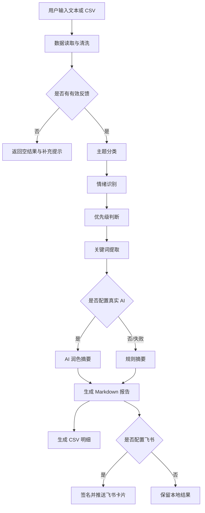

# 工作流说明

## 智能体逻辑结构

本项目采用“感知-分析-行动”的轻量智能体结构。

感知层：

- 从 CSV、TXT、Web 文本框接收输入；
- 自动识别中文字段；
- 过滤空白和无效内容。

分析层：

- 主题分类；
- 情绪识别；
- 优先级判断；
- 关键词提取；
- 真实 AI 摘要润色，失败时回退到规则摘要。

行动层：

- 生成 Markdown 报告；
- 生成可下载 CSV；
- 通过飞书机器人推送给班级或课程团队；
- 通过 CLI、Docker 和环境变量支持跨设备部署。
